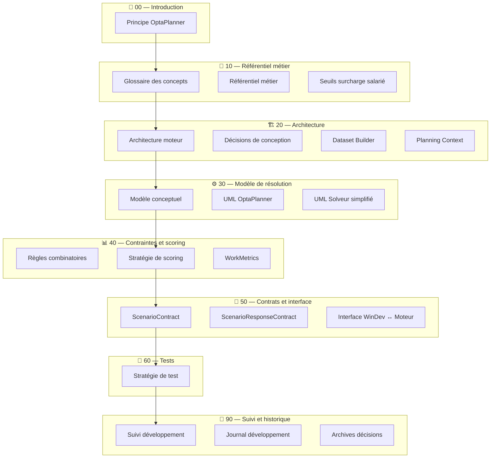

# 📚 Documentation — Moteur de planification

Ce dossier contient la documentation technique et métier du moteur de planification.

Les documents sont organisés par **niveau de responsabilité** afin de faciliter la navigation et la compréhension globale du moteur.

# Diagramme de navigation

---

# Rôle des familles documentaires

La documentation du moteur de planification est structurée en plusieurs familles
de documents ayant chacune un rôle précis.

Cette séparation vise à éviter les confusions entre :
- règles métier
- décisions d’architecture
- état du développement
- historique du projet.

---

## Série 00 — Introduction

Le document de la série **00** constitue le point d’entrée du projet.

Il explique :
- le fonctionnement général du moteur
- les principes OptaPlanner
- la logique d’ensemble avant toute lecture technique.

---

## Série 10 — Référentiel métier

Les documents de la série **10** définissent le vocabulaire et les règles métier partagés.

Ils contiennent :
- les définitions canoniques des concepts (créneau, ressource, score…)
- le référentiel d’activités utilisé par le moteur
- les seuils métier de surcharge.

Ces documents font autorité pour le vocabulaire du projet.

---

## Série 20 — Décisions d’architecture

Les documents de la série **20** décrivent les **choix de conception
structurants du moteur**.

Ils contiennent :
- les invariants d’architecture
- les conventions techniques
- les décisions structurantes
- les règles de séparation des responsabilités.

Ces documents font autorité pour l’architecture du moteur.

Ils ne contiennent jamais :
- d’historique de développement
- d’état d’avancement
- de roadmap.

---

## Série 30 — Modèle de résolution

Les documents de la série **30** décrivent le modèle de données du solveur.

Ils contiennent :
- le modèle conceptuel du domaine
- les diagrammes UML du monde OptaPlanner
- les vues simplifiées de la structure de résolution.

Ces documents servent de référence visuelle pour comprendre les objets manipulés par le solveur.

---

## Série 40 — Référentiel fonctionnel du moteur

Les documents de la série **40** décrivent les **concepts métier
et la logique fonctionnelle du moteur**.

Ils définissent notamment :
- les WorkMetrics
- la stratégie de scoring
- les indicateurs métier
- les principes d’évaluation d’un planning.

Ces documents servent de référence pour l’implémentation
des règles dans le moteur.

---

## Série 50 — Interfaces et contrats

Les documents de la série **50** définissent les contrats d’échange entre le moteur et ses appelants.

Deux sous-ensembles coexistent :
- les **contrats fonctionnels stables** (`50_ScenarioContract*`, `50_ScenarioResponseContract*`) : référence normative indépendante de l’intégrateur
- les **documents d’intégration WinDev** (`50_interface_windev_moteur*`) : implémentation concrète, exemples, jalons de migration.

Ces documents ne contiennent jamais de règles métier ni de décisions d’architecture.

---

## Série 60 — Tests

Le document de la série **60** définit la stratégie de test du moteur.

Il précise :
- les niveaux de test et leurs garanties
- ce que les tests prouvent et ne prouvent pas
- les conventions de nommage et d’organisation.

---

## Série 90 — Pilotage du développement

Les documents de la série **90** décrivent :
- l’état réel du moteur
- les capacités implémentées
- les fonctionnalités manquantes
- les jalons de développement.

Ils ne redéfinissent jamais les règles métier ni l’architecture.

Ils doivent rester alignés avec le code.

---

## Série 91 — Journal de développement

Les documents de la série **91** conservent la mémoire du projet :
- étapes de développement
- validations techniques
- décisions prises pendant l’implémentation.

Ils ne constituent pas la source de vérité actuelle du moteur.

---

# 🧭 0 — Introduction

| Document                        | Description                                                                          |
| ------------------------------- | ------------------------------------------------------------------------------------ |
| `00_PRINCIPE_OPTAPLANNER.md`    | Introduction au fonctionnement du moteur et aux principes OptaPlanner                |

---

# 🧠 10 — Référentiel métier

| Document                         | Description                               |
| -------------------------------- | ----------------------------------------- |
| `10_GLOSSAIRE_CONCEPTS.md`       | Glossaire des concepts fondamentaux       |
| `10_REFERENTIEL_METIER.md`       | Référentiel métier utilisé par le moteur  |
| `10_SEUILS_SURCHARGE_SALARIE.md` | Seuils métier liés à la surcharge salarié |

---

# 🏗 20 — Architecture du moteur

| Document                                 | Description                                                |
| ---------------------------------------- | ---------------------------------------------------------- |
| `20_DECISIONS_CONCEPTION_OPTAPLANNER.md` | Décisions d’architecture et choix techniques du moteur                   |
| `20_ARCHITECTURE_MOTEUR.md`              | Vue globale de l’architecture du moteur                                  |
| `20_DATASET_BUILDER.md`                  | Construction du monde solveur à partir du contrat scénario               |
| `20_PLANNING_CONTEXT.md`                 | Contexte de résolution : horizon temporel, cadre réglementaire, scoring  |
| `20_MIGRATION_DATASET_ENTREE.md`         | Evolution du dataset d’entrée                                            |

Les document '20_' donnent les principes et invariants de l'information.

---

# ⚙️ 30 — Modèle de résolution

| Document                      | Description                       |
| ----------------------------- | --------------------------------- |
| `30_MODELE_CONCEPTUEL.md`     | Modèle conceptuel du moteur       |
| `30_DIAGRAMME_CONCEPTUEL.md`  | Diagrammes conceptuels du domaine |
| `30_UML_OPTAPLANNER.md`       | UML du modèle OptaPlanner         |
| `30_UML_SOLVEUR_SIMPLIFIE.md` | Vue simplifiée du solveur         |

---

# 📊 40 — Contraintes et scoring

| Document                     | Description                             |
| ---------------------------- | --------------------------------------- |
| `40_REGLES_COMBINATOIRES.md` | Contraintes combinatoires du moteur     |
| `40_STRATEGIE_DE_SCORING.md` | Stratégie de scoring et pondérations    |
| `40_WORKMETRICS.md`          | Calcul des métriques RH post-résolution |

---

# 🔌 50 — Interface moteur & contrats d’échange

Le moteur de planification s’appuie sur trois contrats principaux :
1. un contrat d’entrée décrivant le scénario à résoudre,
2. un contrat technique décrivant la structure JSON utilisée par le moteur,
3. un contrat de sortie décrivant la solution produite par le solveur.

Ces contrats constituent l’interface officielle entre le logiciel de planning
et le moteur de planification.

> **Note de lecture** : Les documents `50_ScenarioContract*` définissent le contrat
> fonctionnel stable (référence normative). Les documents `50_interface_windev_moteur*`
> décrivent l’implémentation concrète de ce contrat entre WinDev et le moteur,
> y compris les phases de migration et les exemples d’intégration.

### Contrats fonctionnels

| Document                            | Description                                |
| ----------------------------------- | ------------------------------------------ |
| `50_ScenarioContract.md`            | Contrat fonctionnel d’entrée du moteur     |
| `50_ScenarioTechnicalContract.md`   | Spécification technique du contrat         |
| `50_ScenarioResponseContract.md`    | Contrat de sortie du moteur                |
| `50_ScenarioContract.schema.json`   | Schéma JSON du contrat d’entrée            |
| `50_ScenarioResponse.schema.json`   | Schéma JSON de la réponse                  |

### Interface WinDev ↔ Moteur

| Document                                      | Description                                              |
| --------------------------------------------- | -------------------------------------------------------- |
| `50_interface_windev_moteur.md`               | Vue d’ensemble, chaîne de traitement, principes          |
| `50_interface_windev_moteur_contrat.md`        | Endpoint, structure requête/réponse, règles, jalons      |
| `50_interface_windev_moteur_contrat_detail.md` | Détail champ par champ, contraintes de validation        |
| `50_interface_windev_moteur_tests.md`          | Batterie de tests automatisés de l’interface             |
| `50_interface_windev_moteur_exemples.md`       | Exemples curl, JSON requête, JSON réponse complet        |

---

# 🧪 60 — Stratégie de test

| Document                        | Description                 |
| ------------------------------- | --------------------------- |
| `60_TESTING_STRATEGY_ENGINE.md` | Stratégie de test du moteur |

---

# 📍 90 — Suivi de développement

| Document                                  | Description                 |
| ----------------------------------------- | --------------------------- |
| `90_SUIVI_DEVELOPPEMENT_MOTEUR.md`        | État d’avancement du moteur |
| `91_JOURNAL_DEVELOPPEMENT_MOTEUR.md`      | Historique du développement |
| `92_ARCHIVES_DES_DECISIONS_TECHNIQUES.md` | Historique des décisions    |
| `92_cadrage_donnees_amont_scenarios.md`   | Données amont attendues de WinDev par scénario (SC-01 → SC-05) : état vérifié, arbitrages ouverts, découpage |
| `92_cadrage_scenario_sc-06.md`            | Cadrage SC-06 — désignation de la ressource la plus à même de couvrir un besoin : intention, arbitrages tranchés, contrats d'entrée/sortie, découpage en lots S1→S7 |
| `92_cadrage_socle_reglementaire.md`       | Lot S7 (clos) — six contraintes réglementaires enregistrées mais dormantes : constat, seuils portés au salarié, réparation lot par lot S7.0→S7.8, journal des écarts de score. §6.1 : deux dormances restantes d'une autre famille (valorisation du jour férié, `DetteReposSurReposHebdomadaire`) |
| `Windev_part/SC-06/sc_06_notice_integration.md` | Notice d'intégration SC-06 pour WinDev : exigences, conventions, lecture de la réponse |

---

# 🔍 Je cherche…

| Question | Document |
| --- | --- |
| Qu’est-ce qu’un créneau, une ressource, un score ? | `10_glossaire_concepts.md` |
| Quelles contraintes le moteur applique-t-il ? | `40_REGLES_COMBINATOIRES.md` |
| Quel JSON envoyer au moteur ? | `50_interface_windev_moteur_exemples.md` |
| Quelle est la structure de la réponse API ? | `50_ScenarioResponseContract.md` |
| Qu’est-ce qui est implémenté aujourd’hui ? | `90_SUIVI_DEVELOPPEMENT_MOTEUR.md` |
| Pourquoi telle décision d’architecture ? | `20_DECISIONS_CONCEPTION_OPTAPLANNER.md` |
| Comment le moteur calcule les heures de nuit ? | `40_WORKMETRICS.md §2` |
| Que signifie le score renvoyé ? | `40_STRATEGIE_DE_SCORING.md` |
| Comment tester l’interface bout en bout ? | `50_interface_windev_moteur_tests.md` |
| Quelle est la prochaine étape de développement ? | `90_SUIVI_DEVELOPPEMENT_MOTEUR.md` |

---

# 🧭 Parcours de lecture par profil

### Nouveau contributeur au projet

1. `00_Principe_Optaplanner.md` — comprendre le moteur
2. `10_glossaire_concepts.md` — vocabulaire partagé
3. `20_ARCHITECTURE_MOTEUR.md` — vue globale de la chaîne
4. `30_UML_SOLVEUR_SIMPLIFIE.md` — modèle visuel
5. `90_SUIVI_DEVELOPPEMENT_MOTEUR.md` — état réel aujourd’hui

### Développeur moteur (contraintes, scoring, WorkMetrics)

1. `20_DECISIONS_CONCEPTION_OPTAPLANNER.md` — invariants à respecter
2. `40_REGLES_COMBINATOIRES.md` — règles métier
3. `40_STRATEGIE_DE_SCORING.md` — logique de scoring
4. `40_WORKMETRICS.md` — métriques post-résolution
5. `20_DATASET_BUILDER.md` — construction du monde solveur
6. `60_TESTING_STRATEGY_ENGINE.md` — stratégie de test

### Intégrateur WinDev

1. `50_interface_windev_moteur.md` — vue d’ensemble
2. `50_interface_windev_moteur_contrat.md` — endpoint, règles, jalons
3. `50_interface_windev_moteur_contrat_detail.md` — détail des champs
4. `50_interface_windev_moteur_exemples.md` — exemples JSON complets
5. `50_ScenarioResponseContract.md` — structure de la réponse

### Chef de projet / pilotage

1. `90_SUIVI_DEVELOPPEMENT_MOTEUR.md` — état et roadmap
2. `90_plan_migration_temporaire_windev_vers_moteur.md` — jalons d’intégration
3. `40_STRATEGIE_DE_SCORING.md` — logique fonctionnelle

---

## Gouvernance documentaire

| Document | Rôle |
| --- | --- |
| `20_DECISIONS_CONCEPTION_OPTAPLANNER.md` | invariants et décisions d’architecture |
| `90_SUIVI_DEVELOPPEMENT_MOTEUR.md` | état réel du moteur |
| `91_JOURNAL_DEVELOPPEMENT_MOTEUR.md` | historique du développement |
| `92_ARCHIVES_DES_DECISIONS_TECHNIQUES.md` | décisions techniques structurantes |
| `40_STRATEGIE_DE_SCORING.md` | fonctionnement théorique du scoring |

Principe fondamental :
- **20_DECISIONS explique les invariants d’architecture**
- **92 explique pourquoi une décision a été prise**
- **40 décrit comment fonctionne le modèle**
- **90 décrit ce qui est réellement implémenté**
- **91 garde la mémoire des étapes du projet**

Une règle métier ou une implémentation ne doit apparaître **que dans le document correspondant à son niveau** afin d’éviter les divergences documentaires.