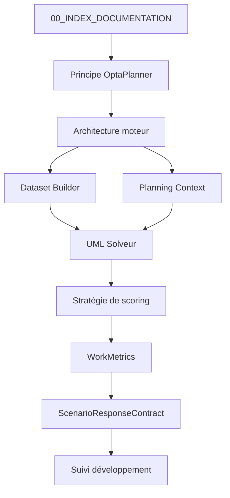

# 📚 Documentation — Moteur de planification

Ce dossier contient la documentation technique et métier du moteur de planification.

Les documents sont organisés par **niveau de responsabilité** afin de faciliter la navigation et la compréhension globale du moteur.

# Diagramme de navigation

---

# Rôle des familles documentaires

La documentation du moteur de planification est structurée en plusieurs familles
de documents ayant chacune un rôle précis.

Cette séparation vise à éviter les confusions entre :
- règles métier
- décisions d’architecture
- état du développement
- historique du projet.

---

## Série 20 — Décisions d’architecture

Les documents de la série **20** décrivent les **choix de conception
structurants du moteur**.

Ils contiennent :
- les invariants d’architecture
- les conventions techniques
- les décisions structurantes
- les règles de séparation des responsabilités

Ces documents font autorité pour l’architecture du moteur.

Ils ne contiennent jamais :

- d’historique de développement
- d’état d’avancement
- de roadmap.

---

## Série 40 — Référentiel fonctionnel du moteur

Les documents de la série **40** décrivent les **concepts métier
et la logique fonctionnelle du moteur**.

Ils définissent notamment :
- les WorkMetrics
- la stratégie de scoring
- les indicateurs métier
- les principes d’évaluation d’un planning.

Ces documents servent de référence pour l’implémentation
des règles dans le moteur.

---

## Série 90 — Pilotage du développement

Les documents de la série **90** décrivent :
- l’état réel du moteur
- les capacités implémentées
- les fonctionnalités manquantes
- les jalons de développement.

Ils ne redéfinissent jamais les règles métier ni l’architecture.

Ils doivent rester alignés avec le code.

---

## Série 91 — Journal de développement

Les documents de la série **91** conservent la mémoire du projet :
- étapes de développement
- validations techniques
- décisions prises pendant l’implémentation.

Ils ne constituent pas la source de vérité actuelle du moteur.

---

# 🧭 0 — Introduction

| Document                     | Description                                                           |
| ---------------------------- | --------------------------------------------------------------------- |
| `00_PRINCIPE_OPTAPLANNER.md` | Introduction au fonctionnement du moteur et aux principes OptaPlanner |

---

# 🧠 10 — Référentiel métier

| Document                         | Description                               |
| -------------------------------- | ----------------------------------------- |
| `10_GLOSSAIRE_CONCEPTS.md`       | Glossaire des concepts fondamentaux       |
| `10_REFERENTIEL_METIER.md`       | Référentiel métier utilisé par le moteur  |
| `10_SEUILS_SURCHARGE_SALARIE.md` | Seuils métier liés à la surcharge salarié |

---

# 🏗 20 — Architecture du moteur

| Document                                 | Description                                                |
| ---------------------------------------- | ---------------------------------------------------------- |
| `20_DECISIONS_CONCEPTION_OPTAPLANNER.md` | Décisions d’architecture et choix techniques du moteur     |
| `20_ARCHITECTURE_MOTEUR.md`              | Vue globale de l’architecture du moteur                    |
| `20_DATASET_BUILDER.md`                  | Construction du monde solveur à partir du contrat scénario |
| `20_PLANNING_CONTEXT.md`                 | Contexte de résolution transmis au moteur                  |
| `20_HORIZON_TEMPOREL_REGLEMENTAIRE.md`   | Cadre temporel et paramètres réglementaires                |
| `20_MIGRATION_DATASET_ENTREE.md`         | Evolution du dataset d'entrée                              |

Les document '20_' donnent les principes er invariants de l'information.

---

# ⚙️ 30 — Modèle de résolution

| Document                      | Description                       |
| ----------------------------- | --------------------------------- |
| `30_MODELE_CONCEPTUEL.md`     | Modèle conceptuel du moteur       |
| `30_DIAGRAMME_CONCEPTUEL.md`  | Diagrammes conceptuels du domaine |
| `30_UML_OPTAPLANNER.md`       | UML du modèle OptaPlanner         |
| `30_UML_SOLVEUR_SIMPLIFIE.md` | Vue simplifiée du solveur         |

---

# 📊 40 — Contraintes et scoring

| Document                     | Description                             |
| ---------------------------- | --------------------------------------- |
| `40_REGLES_COMBINATOIRES.md` | Contraintes combinatoires du moteur     |
| `40_STRATEGIE_SCORING.md`    | Stratégie de scoring et pondérations    |
| `40_WORKMETRICS.md`          | Calcul des métriques RH post-résolution |

---

# 🔌 50 — Interface moteur & contrats d’échange

Le moteur de planification s’appuie sur trois contrats principaux :
1. un contrat d’entrée décrivant le scénario à résoudre,
2. un contrat technique décrivant la structure JSON utilisée par le moteur,
3. un contrat de sortie décrivant la solution produite par le solveur.

Ces contrats constituent l’interface officielle entre le logiciel de planning
et le moteur de planification.

| Document                            | Description                                                                          |
| ----------------------------------- | ------------------------------------------------------------------------------------ |
| `50_SCENARIO_CONTRACT.md`           | Contrat fonctionnel d’entrée du moteur                                               |
| `50_SCENARIO_TECHNICAL_CONTRACT.md` | Spécification technique du contrat                                                   |
| `50_SCENARIO_RESPONSE_CONTRACT.md`  | Contrat de sortie du moteur                                                          |
| `50_SCENARIO_CONTRACT_SCHEMA.json`  | Schéma JSON du contrat d’entrée                                                      |
| `50_SCENARIO_RESPONSE_SCHEMA.json`  | Schéma JSON de la réponse                                                            |
| `50_INTERFACE_WINDEV_MOTEUR.json`   | Interface d'échange entre l'application et le moteur (entrée, sortie explicabilité)  |

---

# 🧪 60 — Stratégie de test

| Document                        | Description                 |
| ------------------------------- | --------------------------- |
| `60_TESTING_STRATEGY_ENGINE.md` | Stratégie de test du moteur |

---

# 📍 90 — Suivi de développement

| Document                                 | Description                 |
| ---------------------------------------- | --------------------------- |
| `90_SUIVI_DEVELOPPEMENT_MOTEUR.md`       | État d’avancement du moteur |
| `91_JOURNAL_DEVELOPPEMENT_MOTEUR.md`     | Historique du développement |
| `92_ARCHIVES_DES_DECISIONS_TEHNIQUES.md` | Historique des décisions    |

---

# 🧭 Ordre de lecture recommandé

Pour comprendre rapidement le moteur :

1. `00_PRINCIPE_OPTAPLANNER.md`
2. `20_ARCHITECTURE_MOTEUR.md`
3. `30_UML_SOLVEUR_SIMPLIFIE.md`
4. `40_STRATEGIE_SCORING.md`
5. `40_WORKMETRICS.md`
6. `20_DATASET_BUILDER.md`

## Gouvernance documentaire

La documentation du moteur est structurée selon les rôles suivants :

| Document                  | Rôle                                |
|---------------------------|-------------------------------------|
| 90_SUIVI_DEVELOPPEMENT    | état réel du moteur                 |
| 91_JOURNAL_DEVELOPPEMENT  | historique du développement         |
| 92_ARCHIVES_DES_DECISIONS | décisions techniques structurantes  |
| 40_STRATEGIE_SCORING      | fonctionnement théorique du scoring |

Principe fondamental :
- **92 explique pourquoi une décision a été prise**
- **40 décrit comment fonctionne le modèle**
- **90 décrit ce qui est réellement implémenté**
- **91 garde la mémoire des étapes du projet**

Une règle métier ou une implémentation ne doit apparaître **que dans le document correspondant à son niveau** afin d’éviter les divergences documentaires.