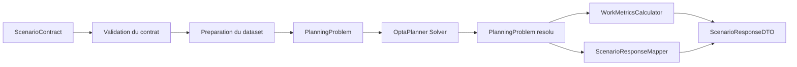
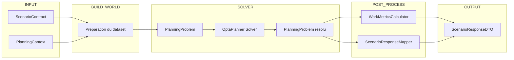

# 🏗️ Architecture du moteur de planification

Ce document présente les **diagrammes d’architecture de référence** du moteur de planification.

Ils servent de référence rapide pour comprendre :

- la chaîne d’exécution complète du moteur
- les responsabilités des principales briques

Ces diagrammes doivent rester synchronisés avec :

- `20_DECISIONS_CONCEPTION_OPTAPLANNER.md`
- `20_DATASET_BUILDER.md`
- `20_PLANNING_CONTEXT.md`
- `50_SCENARIO_RESPONSE_CONTRACT.md`

---

# 1. Pipeline d’exécution du moteur

Ce diagramme décrit **le flux complet de traitement d’un scénario** depuis le contrat d’entrée jusqu’à la réponse API.

### Lecture

1. Le **ScenarioContract** est reçu par l’API.
2. Le contrat est **validé** (schéma + cohérence minimale).
3. La **préparation** construit le monde solveur — `ScenarioDatasetBuilderSc01` pour SC-01,
   `ScenarioDatasetPreparationService` pour les cinq autres (`20_DATASET_BUILDER.md` §9).
4. Le **PlanningProblem** est transmis au solveur.
5. **OptaPlanner** calcule une solution.
6. Le **PlanningProblem résolu** est analysé.
7. Les **WorkMetrics** sont calculées post-résolution.
8. Le **ResponseMapper** construit la réponse API.
9. Le moteur renvoie un **ScenarioResponseDTO**.

> *Diagrammes corrigés le 2026-08-18.* Ils nommaient une classe `PlanningSolution` qui n'existe pas :
> le moteur n'a **qu'une** classe de solution, `PlanningProblem`, porteuse de l'annotation
> `@PlanningSolution` — le solveur en rend une copie résolue. Et ils faisaient passer les six
> scénarios par `ScenarioDatasetBuilder`, alors qu'un seul l'emprunte.

---

# 2. Architecture logique du moteur

Ce diagramme représente la **structure fonctionnelle du moteur** et la séparation des responsabilités.

### Responsabilités

**INPUT**

- `ScenarioContract` : contrat d’entrée fourni par l’appelant
- `PlanningContext` : contexte réglementaire et stratégie de scoring

Le `PlanningContext` regroupe les paramètres structurants
du moteur pour un scénario donné :
- horizon temporel
- paramètres réglementaires
- stratégie de scoring
- hypothèses d’historique

Le `PlanningContext` est considéré comme **un fait immuable**
pendant toute la résolution du scénario.

Il est injecté dans le `ScenarioDatasetBuilder`
et utilisé ensuite par certaines contraintes et par le calcul
des WorkMetrics.

**BUILD_WORLD**

- **Préparation du dataset** : traduction contrôlée du contrat vers le monde solveur —
  `ScenarioDatasetBuilderSc01` pour SC-01, `ScenarioDatasetPreparationService` pour SC-02 à SC-06

**SOLVER**

- `PlanningProblem` : le modèle OptaPlanner, et **la seule classe de solution du moteur** — c'est
  elle qui porte `@PlanningSolution`. Le solveur en reçoit une copie non résolue et en rend une
  résolue ; il n'existe pas de seconde classe pour le résultat
- `Solver` : moteur d’optimisation

**POST_PROCESS**

- `WorkMetricsCalculator` : analyse RH post-résolution
- `ScenarioResponseMapper` : transformation vers le modèle API

**OUTPUT**

- `ScenarioResponseDTO` : réponse API stabilisée

# 3. Invariant d’architecture

Le moteur repose sur une séparation stricte :

| Couche         | Responsabilité                |
|----------------|-------------------------------|
| DatasetBuilder | construit le monde solveur    |
| Solver         | optimise les affectations     |
| WorkMetrics    | analyse la solution           |
| Mapper         | expose une réponse API stable |

Aucune de ces couches ne doit absorber la responsabilité d’une autre.

---

# 4. Invariants fondamentaux du moteur

Les règles suivantes constituent les **invariants d’architecture**
du moteur de planification.

Toute évolution du moteur doit respecter ces principes.

---

## Séparation des couches

Le moteur repose sur quatre responsabilités distinctes :
1. construction du monde solveur
2. optimisation des affectations
3. analyse du planning résultant
4. exposition d’une réponse API

Ces responsabilités correspondent aux composants suivants :

| Couche       | Composant                                                    |
|--------------|--------------------------------------------------------------|
| Construction | `ScenarioDatasetBuilderSc01` · `ScenarioDatasetPreparationService` |
| Optimisation | OptaPlanner Solver                                           |
| Analyse      | `WorkMetricsCalculator`                                      |
| Exposition   | `ScenarioResponseMapper`                                     |

Chaque couche possède une responsabilité unique.

---

## Unicité du constructeur du monde solveur

**La couche de construction est la seule autorisée** à construire les objets du monde solveur :
- `PlanningProblem`
- entités de planning
- faits immuables

Elle a deux implémentations, et deux seulement : `ScenarioDatasetBuilderSc01` pour SC-01,
`ScenarioDatasetPreparationService` pour les cinq autres scénarios. Aucune autre couche ne doit
modifier ces structures.

> Une exception à connaître, et elle confirme la règle : `PlanningProblem` **dérive lui-même**
> certains faits de problème plutôt que de les recevoir — `JoursDisponiblesSalarie` en est un. Le
> motif est explicite : un fait posé par les services de préparation peut être oublié par l'un
> d'eux, et une jointure OptaPlanner étant *interne*, l'oubli désactiverait silencieusement une
> contrainte pour le salarié concerné. Un fait qu'aucun service ne pose est un fait qu'aucun
> service ne peut oublier.

---

## Indépendance du solveur

Le solveur :
- ne connaît pas les WorkMetrics
- ne connaît pas la réponse API
- ne connaît pas les couches de restitution

Il manipule uniquement :
- `PlanningProblem`
- les entités de planning
- les contraintes OptaPlanner.

---

## Post-traitement strict des WorkMetrics

Les WorkMetrics sont calculées **après résolution complète du planning**.

Elles :
- ne sont jamais des variables de décision
- ne participent pas à la faisabilité
- ne modifient jamais les affectations.

---

## Indépendance du mapping API

Le `ScenarioResponseMapper` :
- transforme la solution interne en réponse API
- ne modifie jamais la solution
- ne participe jamais au scoring.

---

## Sens unique du flux de données

Le flux de données du moteur est strictement unidirectionnel :

---

# 5. Objectif de ces diagrammes

Ces deux diagrammes permettent :
- de comprendre rapidement l’architecture du moteur
- de guider l’intégration côté WebDev
- de faciliter l’onboarding de nouveaux développeurs
- de vérifier que les responsabilités restent bien séparées

Ils constituent la **vue d’ensemble officielle du moteur de planification**.

---

**Fin du document**

