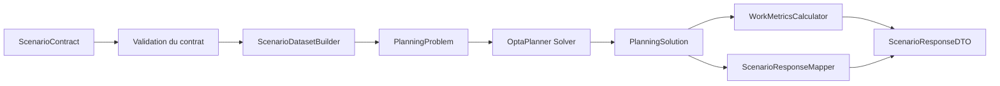
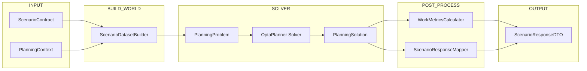

# 🏗️ Architecture du moteur de planification

Ce document présente les **diagrammes d’architecture de référence** du moteur de planification.

Ils servent de référence rapide pour comprendre :

- la chaîne d’exécution complète du moteur
- les responsabilités des principales briques

Ces diagrammes doivent rester synchronisés avec :

- `DECISIONS_CONCEPTION_OPTAPLANNER.md`
- `DATASET_BUILDER.md`
- `PLANNING_CONTEXT.md`
- `ScenarioResponseContract.md`

---

# 1. Pipeline d’exécution du moteur

Ce diagramme décrit **le flux complet de traitement d’un scénario** depuis le contrat d’entrée jusqu’à la réponse API.

### Lecture

1. Le **ScenarioContract** est reçu par l’API.
2. Le contrat est **validé** (schema + cohérence minimale).
3. Le **DatasetBuilder** construit le monde solveur.
4. Le **PlanningProblem** est transmis au solveur.
5. **OptaPlanner** calcule une solution.
6. La **PlanningSolution** obtenue est analysée.
7. Les **WorkMetrics** sont calculées post-résolution.
8. Le **ResponseMapper** construit la réponse API.
9. Le moteur renvoie un **ScenarioResponseDTO**.

---

# 2. Architecture logique du moteur

Ce diagramme représente la **structure fonctionnelle du moteur** et la séparation des responsabilités.

### Responsabilités

**INPUT**

- `ScenarioContract` : contrat d’entrée fourni par l’appelant
- `PlanningContext` : contexte réglementaire et stratégie de scoring

**BUILD_WORLD**

- `ScenarioDatasetBuilder` : traduction contrôlée du contrat vers le monde solveur

**SOLVER**

- `PlanningProblem` : modèle OptaPlanner
- `Solver` : moteur d’optimisation
- `PlanningSolution` : solution produite

**POST_PROCESS**

- `WorkMetricsCalculator` : analyse RH post-résolution
- `ScenarioResponseMapper` : transformation vers le modèle API

**OUTPUT**

- `ScenarioResponseDTO` : réponse API stabilisée

# 3. Invariant d’architecture

Le moteur repose sur une séparation stricte :

| Couche         | Responsabilité                |
|----------------|-------------------------------|
| DatasetBuilder | construit le monde solveur    |
| Solver         | optimise les affectations     |
| WorkMetrics    | analyse la solution           |
| Mapper         | expose une réponse API stable |

Aucune de ces couches ne doit absorber la responsabilité d’une autre.

---

# 4. Objectif de ces diagrammes

Ces deux diagrammes permettent :

- de comprendre rapidement l’architecture du moteur
- de guider l’intégration côté WebDev
- de faciliter l’onboarding de nouveaux développeurs
- de vérifier que les responsabilités restent bien séparées

Ils constituent la **vue d’ensemble officielle du moteur de planification**.

---

**Fin du document**

