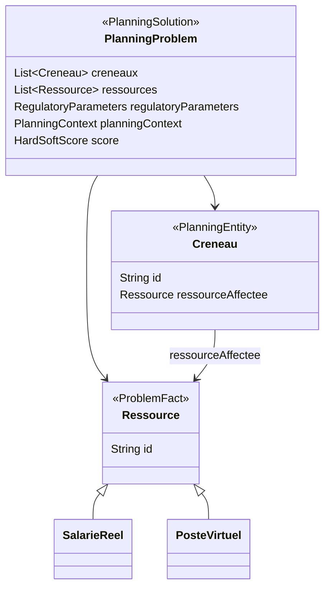
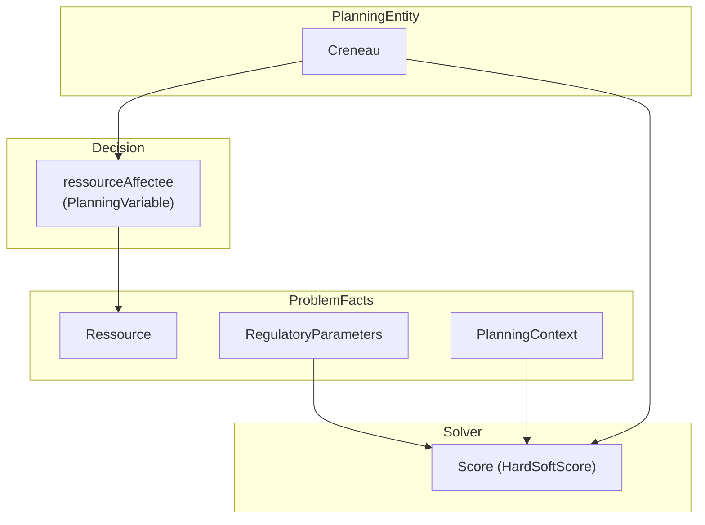

# Modèle OptaPlanner

## Vue d’ensemble du modèle OptaPlanner

## Structure des entités du solveur

## Rôles OptaPlanner dans le modèle

---

> ## Corrigé le 2026-08-18
>
> Ce document nommait `PlanningSolution` une classe qui n'existe pas, et la vue d'ensemble portait
> une flèche `PlanningProblem --> PlanningSolution` qui laissait croire à deux objets distincts. Il
> n'y en a **qu'un** : `PlanningProblem`, porteur du stéréotype `@PlanningSolution`. Le solveur en
> reçoit une copie non résolue et en rend une résolue.
>
> Les identifiants de `Creneau` et de `Ressource` sont des `String`, non des `Long` : ce sont ceux
> que l'appelant transmet, restitués à l'identique.
>
> **Les faits de problème sont plus nombreux que ce diagramme ne le montre.** Outre `Ressource`,
> `RegulatoryParameters` et `PlanningContext`, `PlanningProblem` porte les indisponibilités, les
> repos hebdomadaires, les seuils de surcharge, les périmètres arbitrés, le référentiel de
> comptabilité d'activité et les jours disponibles par salarié.
>
> Ce dernier mérite une mention, parce qu'il est le seul de son espèce : `JoursDisponiblesSalarie`
> est **dérivé par `PlanningProblem` lui-même**, non transmis par un service de préparation. Une
> jointure OptaPlanner étant *interne*, un fait oublié par un service ferait sortir le salarié
> concerné de la contrainte — l'équité serait silencieusement désactivée pour lui. Un fait
> qu'aucun service ne pose est un fait qu'aucun service ne peut oublier.
