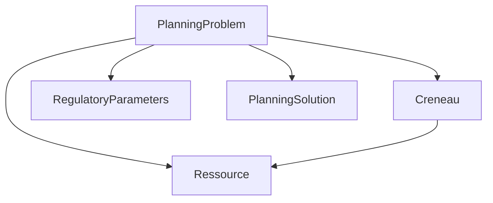
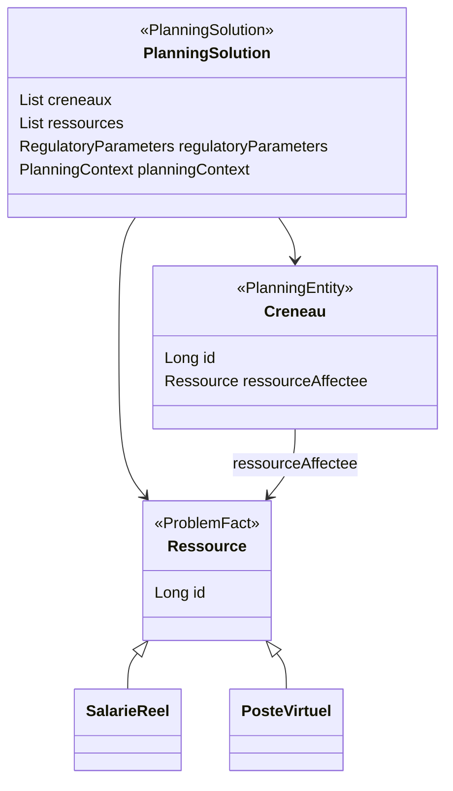
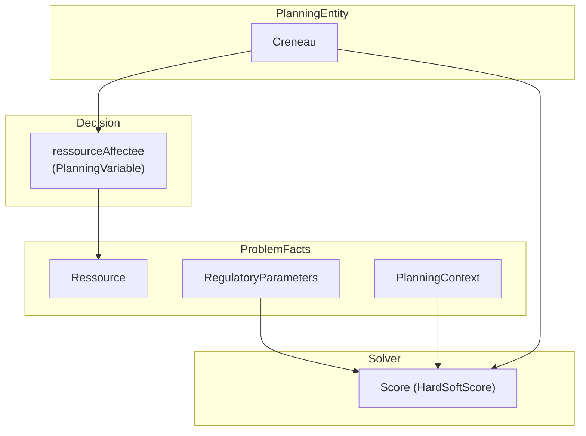

# Modèle OptaPlanner

## Vue d’ensemble du modèle OptaPlanner

```mermaid
flowchart TD

PlanningProblem --> Creneau
PlanningProblem --> Ressource
PlanningProblem --> RegulatoryParameters

Creneau --> Ressource
PlanningProblem --> PlanningSolution

```

## Structure des entités du solveur

```mermaid
classDiagram

class PlanningSolution {
    <<PlanningSolution>>
    List<Creneau> creneaux
    List<Ressource> ressources
    RegulatoryParameters regulatoryParameters
    PlanningContext planningContext
}

class Creneau {
    <<PlanningEntity>>
    Long id
    Ressource ressourceAffectee
}

class Ressource {
    <<ProblemFact>>
    Long id
}

class SalarieReel
class PosteVirtuel

Ressource <|-- SalarieReel
Ressource <|-- PosteVirtuel

PlanningSolution --> Creneau
PlanningSolution --> Ressource

Creneau --> Ressource : ressourceAffectee

```

## Rôles OptaPlanner dans le modèle

```mermaid
flowchart TD

subgraph ProblemFacts
Ressource
RegulatoryParameters
PlanningContext
end

subgraph PlanningEntity
Creneau
end

subgraph Decision
V1["ressourceAffectee\n(PlanningVariable)"]
end

subgraph Solver
Score["Score (HardSoftScore)"]
end

Creneau --> V1
V1 --> Ressource

RegulatoryParameters --> Score
PlanningContext --> Score
Creneau --> Score

```