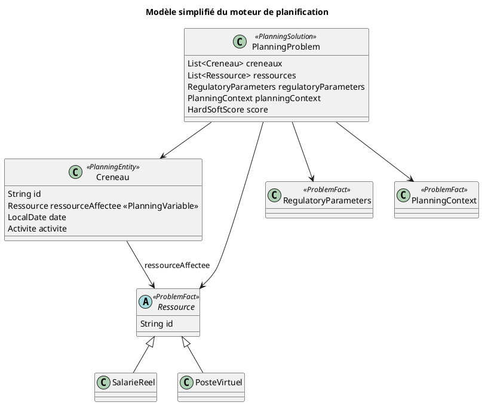

## 📐 Diagramme UML simplifié — Modèle métier du moteur de planification

Ce diagramme représente les entités principales manipulées par le solveur
OptaPlanner. Il s'agit d'une vue conceptuelle simplifiée destinée à
faciliter la compréhension du moteur.

> *Corrigé le 2026-08-18.* La classe s'appelle **`PlanningProblem`** — `PlanningSolution` est le
> nom du **stéréotype** OptaPlanner qu'elle porte, non celui d'une classe du moteur. Et les
> identifiants de `Creneau` et de `Ressource` sont des `String`, non des `Long` : ce sont les
> identifiants transmis par l'appelant, restitués à l'identique et jamais normalisés.
>
> Ce diagramme reste **simplifié** : `PlanningProblem` porte aujourd'hui une dizaine de collections
> de faits de problème (indisponibilités, repos hebdomadaires, seuils de surcharge, périmètres
> arbitrés, jours disponibles…). Voir `30_UML_OPTAPLANNER.md` pour la vue complète.
