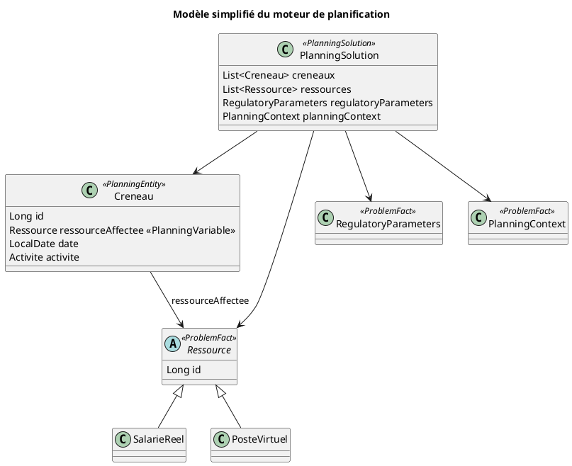

## 📐 Diagramme UML simplifié — Modèle métier du moteur de planification

Ce diagramme représente les entités principales manipulées par le solveur
OptaPlanner. Il s'agit d'une vue conceptuelle simplifiée destinée à
faciliter la compréhension du moteur.

