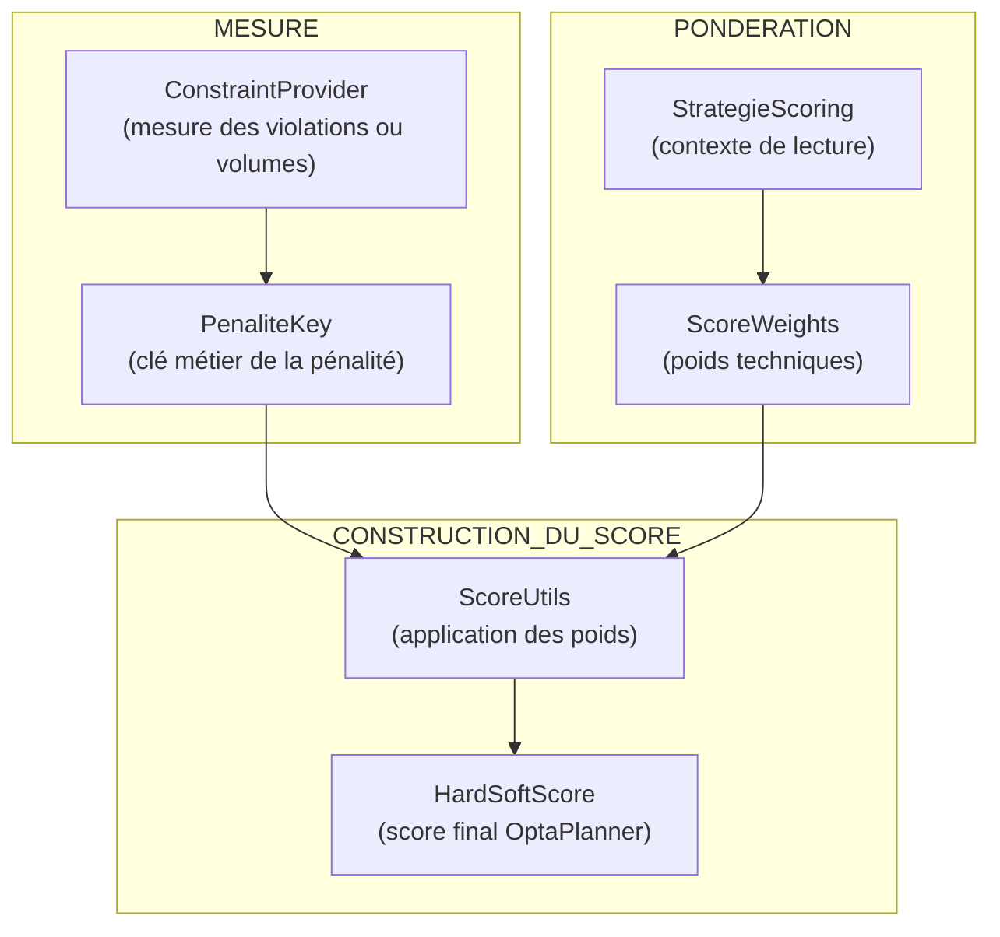

# ⚖️ STRATÉGIE DE SCORING — Moteur de planification

Ce document décrit la **philosophie de scoring** du moteur de planification et
liste les **indicateurs réellement utiles** pour évaluer une solution.

Il sert de référence pour :

* l’implémentation des contraintes OptaPlanner,
* la pondération des règles,
* l’explicabilité des décisions produites par le moteur.

Le scoring est la résultante des pénalités définies :
 * Penalites exprime l’importance relative des règles métier.
 * ScoreWeights traduit ces pénalités en pondérations techniques du score.
Les deux sont volontairement séparés afin de préserver la lisibilité métier et la stabilité du moteur.

## Rôle du score dans le moteur de planification

Le score produit par le moteur de planification a pour unique objectif
d’arbitrer entre plusieurs solutions valides.

Il ne constitue pas :
- une mesure de conformité réglementaire,
- une évaluation RH,
- un indicateur de surcharge individuelle,
- ni un score métier interprétable tel quel.

Toute lecture métier du planning repose sur les WorkMetrics,
calculées après résolution.

---

## 1. Principe fondamental

> Le moteur ne cherche pas une solution parfaite,
> mais la **solution la moins mauvaise**,
> en rendant visibles les compromis réalisés.

Le score est l’**expression chiffrée** de ces compromis.

---

## 2. Rôle du scoring dans le moteur

Le scoring permet de :

* comparer des solutions imparfaites,
* arbitrer entre des violations concurrentes,
* rendre mesurable le coût des décisions.

Il ne sert pas à :

* calculer la paie,
* appliquer exhaustivement le droit du travail,
* masquer des impossibilités métier.

---

## 3. Hiérarchie des contraintes

Les contraintes sont classées selon leur **gravité**.

### 3.1 Contraintes HARD

Les contraintes HARD représentent des règles impératives :
- légales,
- réglementaires,
- ou structurelles.

Toute solution violant une contrainte HARD est considérée comme invalide
et éliminée par le solveur.

Exemples :
- dépassement du nombre maximal de nuits consécutives,
- non-respect d’un repos obligatoire,
- incompatibilité ressource / activité.

---

### 3.2 Contraintes SOFT

Les contraintes SOFT représentent des préférences ou des objectifs
d’amélioration de la qualité du planning.

Elles permettent :
- d’arbitrer entre plusieurs solutions valides,
- de favoriser des solutions plus équilibrées,
- sans jamais invalider une solution légale.

Exemples :
- approche d’un seuil réglementaire,
- répartition plus équitable des nuits,
- limitation du recours aux postes virtuels.

---

## 4. Indicateurs utilisés pour le scoring (WorkMetrics)

Les indicateurs sont des **conséquences des décisions**,
calculées à partir des affectations retenues.

Ils ne sont jamais des décisions en tant que telles.

## Pondération technique du score (ScoreWeights)

La pondération du score est assurée par le composant `ScoreWeights`.

`ScoreWeights` :
- est strictement technique,
- ne porte aucune règle métier,
- traduit les pénalités métier (`Penalites`) en pondérations du score OptaPlanner.

Il permet notamment :
- de garantir la domination absolue des contraintes HARD,
- d’adapter l’importance relative des contraintes SOFT,
- de faire varier le comportement du solveur selon la `StrategieScoring`.

La relation entre les concepts est volontairement unidirectionnelle :

Penalites → ScoreWeights → Score OptaPlanner

## Score et WorkMetrics : séparation des responsabilités

Le score est utilisé exclusivement par le moteur pour comparer des solutions.

Les WorkMetrics :
- ne participent pas au calcul du score,
- ne sont pas modifiées par les contraintes,
- sont calculées après résolution.

Elles constituent le support unique de :
- l’explicabilité,
- l’analyse métier,
- la restitution RH.

Il n’existe volontairement aucune correspondance directe
entre une valeur de score et un indicateur métier.

---

### 4.1 Séparation “restitution” vs “arbitrage” (décision V3)

Le moteur calcule plusieurs familles d’indicateurs temporels (WorkMetrics), mais tous ne servent pas au scoring.

**A. Compteurs de restitution (hors scoring)**

Les compteurs de “travail” (ex. minutes/heures travaillées par jour, par semaine, par mois, par lieu, par activité) sont strictement destinés à la restitution et au reporting.

Ils servent à :
- afficher des tableaux de charge,
- expliquer un planning,
- alimenter l’analyse aval.

Ils ne participent jamais à l’arbitrage du solveur (aucune pénalité, aucun poids, aucune dominance).

**B. Compteurs d’arbitrage (scoring)**

Le scoring du moteur repose exclusivement sur des compteurs de pénibilité / coût organisationnel, exprimés en minutes.

En V2/V3, les axes d’arbitrage sont :
- travail de nuit (minutes)
- travail du dimanche (minutes)
- travail de jour férié (minutes)

Ces volumes sont calculés par intersection temporelle (sans découpage de créneaux), puis pondérés via ScoreWeights.

**C. Dominance sur chevauchements (anti double-pondération)**

Une minute peut appartenir à plusieurs catégories (ex. nuit + dimanche).
Les volumes partiels sont calculés séparément à des fins de mesure et d’explicabilité.

Cependant, le scoring ne doit pas appliquer une “double peine” par défaut.

- Décision retenue :
  - le système calcule explicitement des volumes d’intersection :
  - minutesNuitEtDimanche
  - minutesNuitEtFerie
  - (optionnel) minutesDimancheEtFerie
- et le scoring applique une dominance (via le système de pondération et la clé de pénalité métier) de façon à ce que :
  - une minute chevauchante soit pénalisée selon une règle unique maîtrisée,
  - plutôt que par addition naïve de toutes les pénalités.

Une analyse d’impact V2 est requise pour aligner toutes les contraintes en minutes sur ce mécanisme.

**Statut / périmètre**

Décision structurante V3.
Une analyse d’impact sur V2 sera menée afin :
- d’identifier les écarts de mesure introduits,
- d’adapter les tests,
- de préserver les invariants de dominance et de pondération.

**Principe**
Le moteur ne découpe jamais les créneaux. Les volumes (nuit, dimanche, férié) sont calculés par intersection temporelle à la minute.

**Primitive**
minutesIntersect(A, B) renvoie la durée d’intersection de deux intervalles [start, end).

**Volumes**
Pour tout créneau travaillé (compteDansCharge=true), le moteur calcule :
- minutesNuit
- minutesDimanche
- minutesFerie

**Chevauchements**
Une minute peut appartenir à plusieurs catégories (ex. nuit et dimanche). Les volumes sont indépendants et explicatifs.
Les règles de non-double-pondération relèvent du scoring (système de pondération / clé de pénalité métier), pas de la mesure.

---

#### 4.1.1 Principe général de dominance — “Plus favorable au salarié”

En cas de chevauchement de catégories temporelles (ex. nuit + dimanche, nuit + férié, dimanche + férié), le moteur applique une règle de dominance fondée sur le principe suivant :
- La pénalité retenue est celle correspondant à la situation la plus favorable au salarié.

Cette règle vise à :
- éviter la double-pondération d’une même minute,
- rester cohérent avec l’esprit protecteur du droit du travail,
- maintenir un arbitrage lisible et stable.

L’ordre de dominance est fourni explicitement par le contexte (`PlanningContext` / paramètres réglementaires).
Il représente la règle “la plus favorable au salarié” dans le cadre client.

En l’absence de paramètre, un ordre par défaut documenté est appliqué (ex. NUIT > DIMANCHE > FERIE), mais ce comportement doit rester une option contrôlée.

Ce principe s’applique exclusivement au scoring.
Les volumes bruts (minutesNuit, minutesDimanche, minutesFerie) restent disponibles à des fins d’explicabilité.

---

### 4.2 Indicateurs métier (hors scoring)

Les indicateurs métier tels que :
- heuresTravaillees
- heuresNuit
- heuresJourFerie
- heuresReposHebdoTravaille
- heuresSupplementaires
- detteReposCompensateur

sont des **WorkMetrics de restitution**.

Ils :
- ne participent pas au calcul du score,
- ne sont pas utilisés pour arbitrer les solutions,
- sont calculés après résolution.

Le scoring repose exclusivement sur :
- des mesures élémentaires (volumes, violations),
- exprimées en unités directement exploitables par le solveur.

Cette séparation garantit :
- la lisibilité de l’architecture,
- l’absence de confusion entre arbitrage et analyse métier,
- la stabilité du moteur face aux évolutions métier.

---

### 4.3 Indicateurs utiles mais non bloquants

Ces indicateurs améliorent l’arbitrage mais peuvent être introduits plus tard.

| Indicateur                   | Description                    |         |
| ---------------------------- | ------------------------------ | ------- |
| `joursConsecutifsTravailles` | Nombre de jours consécutifs    | Fatigue |
| `variationsAmplitude`        | Variations d’horaires          | Confort |
| `desiquilibreCharge`         | Écart de charge entre salariés | Équité  |
| `tauxOccupation`             | Charge vs capacité cible       | Aide RH |

---

### 4.4 Indicateurs volontairement exclus

Ces éléments sont **hors périmètre** du moteur :

* calcul de rémunération,
* calcul de primes,
* valorisation financière exacte,
* gestion fine des contrats.

Ils peuvent exister **en aval**, hors du solveur.

---

## 5. Pondération relative (exemple)

Les valeurs exactes ne sont pas figées,
mais les **ordres de grandeur** sont structurants.

| Catégorie   | Ordre de grandeur |
| ----------- | ----------------- |
| Physique    | HARD              |
| Légal       | -10 000           |
| Dette repos | -5 000            |
| Métier      | -1 000            |
| Service     | -100              |
| Personnel   | -10               |

👉 Ce tableau exprime une **priorité relative**,
pas une implémentation chiffrée définitive.

---

## 6. Invariants de scoring

* Les contraintes physiques sont inviolables.
* Les contraintes légales sont prioritaires sur toute autre.
* Les dettes doivent toujours être visibles dans les résultats.
* Le score doit rester explicable.
* Une solution peut être acceptée même imparfaite.

---

## 7. Classification des contraintes

| Classe        | Exemple                |
| ------------- | ---------------------- |
| HARD_PHYSICAL | chevauchement créneaux |
| HARD_LEGAL    | repos minimum          |
| SOFT_SERVICE  | couverture besoin      |
| SOFT_EQUITY   | équilibre travail      |

---

## 8. Scoring pipeline

---

## 9. Utilisation dans le solveur

Les **WorkMetrics** ne sont pas utilisées par le solveur comme variables de décision et ne pilotent jamais directement l’affectation des créneaux.

Elles restent :
- des **constats post-résolution**,
- calculés à partir d’un planning résolu,
- destinés à l’explicabilité, à la restitution et à l’analyse aval.

### Distinction importante

Il convient de distinguer deux niveaux :

#### A. Primitives de mesure utilisées pendant l’évaluation

Le moteur utilise, dans certaines contraintes de scoring, des **mesures élémentaires** issues du calcul temporel, notamment :
- minutes de nuit,
- minutes de dimanche,
- minutes de jour férié,
- minutes d’intersection entre pénibilités.

Ces mesures sont calculées à partir des créneaux affectés, via le composant de calcul temporel, et servent à alimenter le scoring des pénibilités légales (`PenibilitesLegalesMinutes`).

Elles constituent des **primitives de mesure**, pas des WorkMetrics de restitution.

#### B. WorkMetrics de restitution

Les WorkMetrics, au sens du présent document, sont des **agrégats descriptifs** produits après résolution, par exemple :
- `heuresTravaillees`
- `heuresNuit`
- `heuresJourFerie`
- `nbDimanchesTravailles`
- `maxJoursConsecutifsObservees`
- `maxNuitsConsecutivesObservees`

Ces indicateurs :
- n’interviennent pas dans la faisabilité,
- ne déclenchent aucune contrainte HARD,
- ne modifient jamais le planning,
- ne constituent jamais une variable de décision.

### Règle de cohérence

Le solveur peut consommer des **mesures élémentaires** pour scorer certaines contraintes.

En revanche, les **WorkMetrics** exposées par le moteur restent exclusivement des **constats post-résolution**.

Cette séparation garantit :
- la lisibilité de l’architecture,
- la stabilité de l’explicabilité,
- l’absence de confusion entre **arbitrage** et **restitution**.

---

## 10. StrategieScoring

### Définition

La **StrategieScoring** définit le mode de lecture et d’arbitrage du moteur.

Elle permet d’adapter le comportement du solveur selon l’objectif métier recherché.

Elle est transmise dans le `PlanningContext` via le champ : `planningContext.strategieScoring`

---

### Valeurs disponibles

#### EXPLOITATION

**Objectif**

Produire un planning opérationnel exploitable.

**Caractéristiques**

- priorité forte à la couverture des besoins
- limitation du recours aux postes virtuels
- respect des contraintes légales
- arbitrage orienté service

**Usage**

- génération de planning réel
- préparation opérationnelle
- exploitation quotidienne

---

#### ANALYSE_RH

**Objectif**

Analyser l’impact du planning sur les ressources humaines.

**Caractéristiques**

- mise en évidence des déséquilibres de charge
- accent sur la pénibilité (nuit, dimanche, férié)
- arbitrage plus tolérant sur la couverture

**Usage**

- analyse de charge
- étude d’équité
- diagnostic RH

---

#### AUDIT

**Objectif**

Observer les limites du système sans contrainte opérationnelle forte.

**Caractéristiques**

- tolérance maximale aux imperfections
- mise en évidence des impossibilités
- score orienté diagnostic

**Usage**

- audit de données
- test de scénarios
- validation de cohérence

---

### Impact sur le moteur

La stratégie influence :

- les pondérations dans `ScoreWeights`
- l’importance relative des contraintes SOFT
- le comportement d’arbitrage du solveur

Elle ne modifie pas :

- les contraintes HARD
- la structure des données
- le modèle du problème

---

### Principe fondamental

> La stratégie de scoring ne change pas le problème à résoudre,
> elle change la manière dont le moteur arbitre entre plusieurs solutions.

---

### Recommandation Produit

Pour une première version :

- valeur par défaut : `EXPLOITATION`
- exposer les 3 modes avec un libellé métier :
  - Exploitation (planning opérationnel)
  - Analyse RH (équité / charge)
  - Audit (diagnostic)

---

## 11. Lien avec les autres documents

Ce document complète :

* le diagramme conceptuel,
* le modèle UML,
* `20_PLANNING_CONTEXT.md`,
* les décisions de conception.

Il sert de référence pour toute évolution des règles de scoring.

