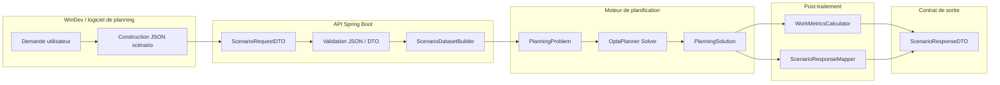

# 50 — Interface WinDev ↔ Moteur de planification

Ce document décrit le rôle, la vue d'ensemble et les principes d'architecture de l'interface entre :

- le **logiciel de planning (WinDev)**
- le **moteur de planification OptaPlanner (Spring Boot)**

Il constitue le **point d'entrée documentaire** de la série 50_interface_windev_moteur.
Pour les détails techniques, voir les documents complémentaires listés en §6.

---

## 🔍 Par où commencer ?

- Intégration API → 50_interface_windev_moteur_contrat.md
- Détail technique → 50_interface_windev_moteur_contrat_detail.md
- Exemples → 50_interface_windev_moteur_exemples.md
- Validation → 50_interface_windev_moteur_tests.md

---

## 1. Rôle de l'interface

L'interface WinDev ↔ moteur est le **contrat d'échange opérationnel** entre les deux systèmes.

Elle garantit :
- que WinDev peut soumettre un scénario de planification au moteur,
- que le moteur retourne une solution exploitable, explicable et stable,
- que les deux systèmes peuvent évoluer indépendamment dans les limites du contrat.

Règle fondamentale :

> **WinDev ne construit jamais de planning.**
> Il décrit un scénario. Le moteur produit la solution.

---

## 2. Vue d'ensemble



Lecture du schéma :

- **WinDev** formule la demande et construit le JSON scénario.
- L'**API Spring Boot** désérialise, valide et traduit le contrat d'entrée.
- Le **DatasetBuilder** transforme le transport JSON en monde solveur exploitable.
- **OptaPlanner** calcule une solution.
- Le **post-traitement** produit les métriques et la réponse API stabilisée.

---

## 3. Chaîne de traitement actuelle

Le flux réel d'exécution est le suivant :

```text
JSON WinDev
    ↓
Jackson (désérialisation)
    ↓
ScenarioRequestDTO
    ↓
ScenarioDatasetBuilderSc01
    ↓
PlanningProblem
    ↓
OptaPlanner Solver
    ↓
PlanningSolution
    ↓
WorkMetricsCalculator + ScenarioResponseMapper
    ↓
ScenarioResponseDTO
```

Le flux d'appel HTTP est :

```text
WinDev
   ↓
POST /scenarios/sc01/solve/file
   ↓
ScenarioController
   ↓
ScenarioService
   ↓
PlanningService
   ↓
OptaPlanner Solver
```

---

## 4. DTO en jeu

Les DTO se répartissent en trois catégories.

#### DTO d'entrée

```text
ScenarioRequestDTO
PlanningContextDTO
HorizonDTO
DataSetDTO
RessourcesDTO
Sc01ScenarioParametersDTO
ResourceRefDTO
LunchBreakDTO
IgnoredCreneauxDTO
```

#### DTO de sortie

```text
ScenarioResponseDTO
SolverResultDTO
ScenarioPlanningDTO
ScoreDTO
SolutionSummaryDTO
DiagnosticsDTO
ScenarioAlertDTO
AssignmentDiagnosticDTO
```

#### DTO analytiques

```text
WorkMetricsDTO
WorkMetricsByRessourceDTO
ScoreBreakdownItemDTO
ScoreBreakdownUnitDTO
```

Ces DTO ont été introduits progressivement pour permettre le branchement du moteur.
Ils ne constituent **pas encore un contrat d'interface complètement stabilisé**.

---

## 5. Principes d'architecture

### Séparation Transport / Domaine / Solveur

L'architecture cible sépare strictement :

```text
Transport API   → DTO d'entrée / sortie (Jackson)
Dataset Builder → traduction du transport en monde solveur
Domain Model    → objets métier du moteur
Solver          → OptaPlanner (boîte noire d'optimisation)
```

### Limites actuelles

Deux limitations ont été identifiées et sont en cours de résolution :

**Couplage DTO / domaine** — certaines structures JSON sont désérialisées directement vers des classes du domaine (`SalarieReel`, `PosteVirtuel`, `Creneau`), créant un couplage fort. Des DTO de transport dédiés seront introduits.

**Contrat d'entrée non stabilisé** — le JSON accepté par l'endpoint, le JSON documenté et le JSON utilisé dans les tests ne sont pas encore parfaitement alignés. La stabilisation est en cours (voir `90_suivi_developpement_moteur.md`).

### Stabilité du contrat de sortie

La solution OptaPlanner est transformée en `ScenarioResponseDTO` par `ScenarioResponseMapper`.
Cette couche garantit la **stabilité du contrat API** indépendamment des évolutions internes du solveur.

---

## 6. Points d'évolution ouverts

Les évolutions suivantes sont identifiées et planifiées :

- [ ] Supprimer la tolérance aux champs inconnus dès que le contrat d'entrée sera stabilisé
- [ ] Introduire des DTO de transport dédiés pour `SalarieReel` et `PosteVirtuel`
- [ ] Transporter le bloc `contraintesReglementaires` par salarié (8 champs définis dans le schéma, non encore transportés)
- [ ] Documenter les codes `reasonCode` possibles dans `AssignmentDiagnosticDTO`
- [ ] Documenter les valeurs possibles de `penaliteKey` dans `ScoreBreakdownItemDTO`

L'état d'avancement détaillé est dans `90_suivi_developpement_moteur.md`.
Le plan de migration progressif est dans `90_plan_migration_temporaire_windev_vers_moteur.md`.

---

## 7. Documents de référence

Ce document est le point d'entrée de la série. Les détails sont dans :

| Document                                        | Contenu                                           |
| ----------------------------------------------- | ------------------------------------------------- |
| `50_interface_windev_moteur_contrat.md`          | Endpoint, structure requête/réponse, règles, jalons |
| `50_interface_windev_moteur_contrat_detail.md`   | Détail champ par champ, contraintes de validation  |
| `50_interface_windev_moteur_tests.md`            | Batterie de tests automatisés de l'interface       |
| `50_interface_windev_moteur_exemples.md`         | Exemples curl, JSON requête, JSON réponse          |
| `50_ScenarioResponseContract.md`                 | Contrat de sortie fonctionnel (référence normative) |
| `90_suivi_developpement_moteur.md`               | État d'avancement et jalons                        |

---

**Fin du document**
