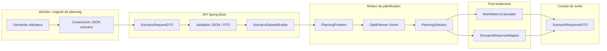

# 60_INTERFACE_WINDEV_MOTEUR.md

## 0 — Contexte

Ce document décrit l’interface entre :

- le **logiciel de planning (WinDev)**
- le **moteur de planification OptaPlanner**

L’objectif est de :

1. décrire **l’état actuel réel de l’interface** ;
2. définir **la cible d’architecture** ;
3. établir **une feuille de route progressive** ;
4. servir de **journal d’avancement** pour éviter les régressions.

Ce document est volontairement **évolutif**.

---

## 1 — Journal des développements à faire et réalisés

Ce bloc sert à tracer : les améliorations à produire de l'interface d'éntrée ainsi que les évolutions validées.

### TODO

- finaliser la complétude du contrat d'entrée
- supprimer la tolérance aux champs inconnus dès que le contrat d’entrée sera complètement formalisé et que les DTO de transport seront stabilisés


### 2026-03-12

Travaux réalisés :

- création du test de désérialisation JSON ;
- stabilisation du dataset SC-01 ;
- clarification du contrat d’entrée.

---

## 2 — État actuel de l’interface

### 2.1 Endpoint principal

```text
POST /scenarios/sc01/solve/file
```

Entrée :

```text
ScenarioRequestDTO
```

Sortie :

```text
ScenarioResponseDTO
```

### 2.2 Chaîne de traitement actuelle

Aujourd’hui, le flux réel est :

```text
JSON WinDev
    ↓
Jackson
    ↓
ScenarioRequestDTO
    ↓
ScenarioDatasetBuilderSc01
    ↓
PlanningProblem
    ↓
OptaPlanner Solver
    ↓
PlanningSolution
    ↓
ScenarioResponseDTO
```

Schéma simplifié :

```text
WinDev
   ↓
JSON
   ↓
DTO (transport)
   ↓
DatasetBuilder
   ↓
Domain Model
   ↓
Solver
   ↓
Solution DTO
```

### 2.3 DTO existants

Aujourd’hui le moteur expose un nombre important de DTO.

Ils se répartissent en 3 catégories.

#### DTO d’entrée

```text
ScenarioRequestDTO
PlanningContextDTO
HorizonDTO
DataSetDTO
RessourcesDTO
Sc01ScenarioParametersDTO
ResourceRefDTO
LunchBreakDTO
IgnoredCreneauxDTO
```

#### DTO de sortie

```text
ScenarioResponseDTO
SolverResultDTO
ScenarioPlanningDTO
ScoreDTO
SolutionSummaryDTO
DiagnosticsDTO
ScenarioAlertDTO
AssignmentDiagnosticDTO
```

#### DTO analytiques

```text
WorkMetricsDTO
WorkMetricsByRessourceDTO
ScoreBreakdownItemDTO
ScoreBreakdownUnitDTO
```

Ces DTO ont été introduits progressivement pour permettre le branchement du moteur.

Ils ne constituent **pas encore un contrat d’interface stabilisé**.

---

## 3 — Limites de l’architecture actuelle

Plusieurs limitations ont été identifiées.

### 3.1 Couplage entre DTO et domaine

Certaines structures JSON sont désérialisées directement vers des classes du domaine :

```text
SalarieReel
PosteVirtuel
Creneau
```

Cela crée :

- un **couplage fort** ;
- une **fragilité de désérialisation** ;
- des erreurs Jackson sur les champs inconnus.

### 3.2 Contrat d’entrée non stabilisé

Aujourd’hui :

- le JSON accepté par l’endpoint ;
- le JSON documenté ;
- le JSON réellement utilisé dans les tests

ne sont pas parfaitement alignés.

Ce point doit être stabilisé.

### 3.3 Jeu de données minimal

SC-01 a été conçu avec un **dataset minimal** pour brancher le solveur.

Il ne représente pas encore :

- les axes organisationnels ;
- les contrats de travail ;
- les contraintes réglementaires ;
- les besoins de couverture.

---

## 4 — Architecture cible

L’architecture cible doit séparer clairement :

```text
Transport API
Dataset Builder
Domain Model
Solver
```

Architecture cible :

```text
JSON WinDev
   ↓
Input DTO (transport)
   ↓
DatasetBuilder
   ↓
Domain Model
   ↓
Solver
   ↓
Output DTO
```

---

## 5 — Contrat d’entrée cible

Le contrat cible devra permettre de transmettre :

### 5.1 Organisation

```text
direction
service
lieu
poste comptable
```

### 5.2 Ressources

Pour chaque salarié :

```text
id
contrat
contraintes réglementaires
axes organisationnels
activités autorisées
```

### 5.3 Planning existant

```text
créneaux existants
créneaux imposés
créneaux libres
```

### 5.4 Besoins de couverture

```text
besoins par lieu
besoins par activité
besoins par période
```

---

### 5.5 Politique actuelle sur les champs inconnus

#### Décision provisoire

À ce stade du projet, les champs inconnus du JSON d’entrée sont **tolérés** à la désérialisation.

Cette tolérance est volontaire et transitoire.
Elle permet de ne pas bloquer l’intégration WinDev pendant la phase de construction et d’alignement du contrat d’entrée.

#### Justification

Le contrat d’entrée n’est pas encore complètement stabilisé :
- certains DTO ont été introduits progressivement,
- la séparation entre transport API et modèle domaine n’est pas encore totalement finalisée,
- la structure JSON documentée et la structure effectivement testée ne sont pas encore parfaitement alignées.

Dans ce contexte, un rejet strict des champs inconnus provoquerait des blocages inutiles pendant le développement.

#### Cible à terme

Lorsque le contrat d’entrée sera complètement formalisé et que les DTO de transport seront figés, la tolérance devra être supprimée.

La cible est alors :

- rejet explicite de tout champ inconnu ;
- protection forte du contrat d’interface ;
- détection immédiate des écarts entre WinDev et moteur.

#### Règle d’intégration

En conséquence :
- **phase actuelle** : champs inconnus tolérés ;
- **phase de stabilisation contractuelle** : champs inconnus rejetés.

---

## 6 — Feuille de route d’évolution

### Phase 1 — Stabilisation du contrat minimal

Objectif :

```text
JSON valide → ScenarioRequestDTO
```

Travaux :

- stabiliser `sc01_dataset_reference.json` ;
- tester la désérialisation ;
- documenter la structure acceptée.

### Phase 2 — Dataset Builder robuste

Objectif :

```text
DTO → PlanningProblem
```

Travaux :

- fiabiliser `ScenarioDatasetBuilderSc01` ;
- enrichir les validations ;
- tracer les incohérences.

### Phase 3 — Extension du dataset

Ajout de :

- axes organisationnels ;
- contrats de travail ;
- contraintes réglementaires.

### Phase 4 — Gestion des besoins

Ajout de :

```text
groupeBesoinId
blocJourId
besoins de couverture
```

### Phase 5 — Scénarios avancés

Création de nouveaux scénarios :

```text
SC-02
SC-03
SC-04
```

---

## 7. Validation automatisée de l’interface moteur

Afin de garantir la stabilité de l’interface entre le logiciel de planning (WinDev) et le moteur de planification, une batterie de tests automatisés a été mise en place côté moteur.

Ces tests couvrent :

* la validité de l’API
* la robustesse des entrées
* la stabilité du solveur
* la reproductibilité des résultats observables

L’ensemble est exécuté via :

```
.\\gradlew test
```

---

# 7.1 Tests d’exécution du scénario

Classe :

```
ScenarioControllerRuntimeTest
```

Objectif :

Vérifier qu’un scénario SC‑01 complet peut être exécuté via l’API HTTP du moteur.

Flux testé :

```
POST /scenarios/sc01/solve
```

Entrée :

```
src/test/resources/scenarios/sc01/sc01_dataset_reference.json
```

Vérifications :

* réponse HTTP 200
* réponse JSON valide
* présence des blocs :

```
planning
workMetrics
solutionSummary
solverResult
scoreBreakdown
```

Ce test garantit que :

* le contrat JSON entre WinDev et le moteur est valide
* le solveur peut traiter un scénario complet

---

# 7.2 Tests de robustesse de l’API

Classe :

```
ScenarioControllerValidationTest
```

Ces tests vérifient que l’API réagit correctement aux erreurs d’entrée.

Cas testés :

| Cas                                | Résultat attendu |
| ---------------------------------- | ---------------- |
| scénario invalide                  | erreur           |
| dataset manquant                   | exception        |
| resourceRef manquant               | exception        |
| ressource inconnue dans le dataset | erreur           |
| horizon invalide                   | erreur           |

Ces tests garantissent que l’interface moteur :

* détecte les erreurs de contrat
* ne produit pas de planification incohérente

---

# 7.3 Test de stabilité du solveur

Classe :

```
PlanningServiceSolverStabilityTest
```

Objectif :

Vérifier que le solveur produit un résultat observable stable pour une même requête.

Procédure :

1. génération d’un PlanningRequest via :

```
TestPlanningRequestFactory
```

2. exécution du solveur deux fois

```
PlanningService.solve(request)
```

3. comparaison :

* du score final
* des affectations
* du scoreBreakdown

Ce test garantit que :

* le solveur n’introduit pas d’aléa observable
* les résultats sont reproductibles

---

# 7.4 Test de cohérence du score

Classe :

```
PlanningServiceScoreRegressionTest
```

Objectif :

Garantir que la structure du score et de son explicabilité reste stable.

Vérifications :

* score final présent
* scoreBreakdown non vide
* chaque item possède :

```
penaliteKey
unit
quantity
weightedImpact
```

Contraintes vérifiées :

* impact pondéré ≤ 0
* score soft ≤ 0

Ce test protège le contrat d’explicabilité du moteur.

---

# 7.5 Factory de génération de scénarios de test

Classe :

```
TestPlanningRequestFactory
```

Rôle :

Créer des scénarios de test cohérents pour les tests unitaires.

Elle génère :

```
PlanningContext
RegulatoryParameters
ReferentielComptabiliteActivite
Ressources
Créneaux
```

Avantages :

* tests indépendants du JSON
* scénarios reproductibles
* simplification des tests du solveur

---

# 7.6 Organisation des tests

```
src/test/java
│
├─ scenarios
│   ├─ api
│   │   ├─ ScenarioControllerRuntimeTest
│   │   ├─ ScenarioControllerValidationTest
│   │   └─ ScenarioControllerSolverStabilityTest
│
├─ solver
│   ├─ PlanningServiceSolverStabilityTest
│   └─ PlanningServiceScoreRegressionTest
│
└─ fixtures
    └─ TestPlanningRequestFactory
```

---

# 7.7 Garanties apportées par la batterie de tests

La validation automatisée garantit que :

* l’API REST reste stable pour WinDev
* les scénarios sont exécutables
* le solveur reste déterministe
* le score et son explicabilité restent cohérents

Ces tests constituent la sécurité principale avant toute évolution du moteur.

---

# 7.8 Architecture d’appel du moteur

Le flux d’appel entre le logiciel de planning et le moteur de planification est le suivant :

```
WinDev
   ↓
POST /scenarios/sc01/solve
   ↓
ScenarioController
   ↓
ScenarioService
   ↓
PlanningService
   ↓
OptaPlanner Solver
```

Le moteur reçoit un scénario complet, exécute la planification via OptaPlanner, puis retourne :

* le planning généré
* les métriques de travail
* un résumé de solution
* le score et son explicabilité

Cette architecture garantit une séparation claire entre :

* l’interface HTTP (contrat externe)
* la logique métier des scénarios
* le moteur de planification lui‑même.

---

# 8. Contrat d’API pour l’intégration WinDev

Cette section formalise le contrat d’appel entre l’application de planning (WinDev) et le moteur de planification.

L’objectif est de garantir :

* une interface stable
* une sérialisation JSON prévisible
* une intégration simple côté client

---

## 8.1 Endpoint principal

```
POST /scenarios/sc01/solve
```

Ce endpoint permet d’exécuter un scénario SC‑01.

Il reçoit un scénario complet décrivant :

* le contexte de planification
* les paramètres du scénario
* le dataset de ressources et créneaux

---

## 8.2 Requête

Format :

```
Content-Type: application/json
Accept: application/json
```

Structure simplifiée de la requête :

```
{
  "scenarioType": "SC-01",
  "planningContext": {...},
  "scenarioParameters": {...},
  "dataSet": {...}
}
```

Principaux blocs :

| Bloc               | Description                        |
| ------------------ | ---------------------------------- |
| scenarioType       | identifiant du scénario            |
| planningContext    | horizon et stratégie de scoring    |
| scenarioParameters | paramètres métier du scénario      |
| dataSet            | ressources et créneaux disponibles |

---

### 8.2.1 Normalisation du champ `workedDays` (SC-01)

Pour le scénario `SC-01`, le champ `workedDays` doit être transmis au format **Java `DayOfWeek` complet** :

- `MONDAY`
- `TUESDAY`
- `WEDNESDAY`
- `THURSDAY`
- `FRIDAY`
- `SATURDAY`
- `SUNDAY`

#### Règle de compatibilité V1

Les formats abrégés suivants ne doivent **pas** être utilisés :

- `MON`
- `TUE`
- `WED`
- `THU`
- `FRI`
- `SAT`
- `SUN`

#### Décision d’intégration

Le logiciel WinDev doit construire ses requêtes SC-01 en utilisant exclusivement le format long `MONDAY…SUNDAY`.

Cette règle est normative pour éviter toute divergence entre :
- le contrat fonctionnel,
- les DTO Java,
- les exemples JSON,
- et l’implémentation côté WinDev.

---

## 8.3 Réponse

La réponse est un JSON contenant le résultat complet de la planification.

Structure simplifiée :

```
{
  "planning": {...},
  "workMetrics": {...},
  "solutionSummary": {...},
  "solverResult": {...},
  "scoreBreakdown": [...]
}
```

Description des blocs :

| Bloc            | Description                               |
| --------------- | ----------------------------------------- |
| planning        | planning généré par le moteur             |
| workMetrics     | métriques calculées sur les ressources    |
| solutionSummary | résumé synthétique de la solution         |
| solverResult    | statut du solveur et score global         |
| scoreBreakdown  | détail des pénalités contribuant au score |

---

## 8.4 Garanties du contrat

L’API garantit les propriétés suivantes :

* réponse JSON valide
* présence systématique des blocs principaux
* score explicable via `scoreBreakdown`
* déterminisme du résultat observable pour une même requête

Ces garanties sont validées automatiquement par la batterie de tests du moteur.

---

## 8.5 Utilisation typique côté WinDev

Flux d’intégration :

```
1. Construction du scénario
2. POST /scenarios/sc01/solve
3. Attente de la réponse JSON
4. Analyse du planning et du score
```

Le moteur est donc utilisé comme un **service de planification stateless**, appelé à la demande par le logiciel de planning.

---

### 8.5.1 Exemples d'utilisation de l'API moteur de planification

Ce document fournit deux exemples pratiques destinés aux équipes intégrant le moteur depuis une application externe (ex : WinDev).

---

#### 1. Exemple d'appel HTTP (curl)

Exécution d'un scénario SC‑01 via l'API.

```bash
curl -X POST "http://localhost:8080/scenarios/sc01/solve" \
  -H "Content-Type: application/json" \
  -H "Accept: application/json" \
  -d @sc01_dataset_reference.json
```

Dans cet exemple :

* le moteur écoute sur `localhost:8080`
* la requête contient un scénario complet
* le fichier JSON correspond au contrat `ScenarioRequestDTO`

---

#### 2. Exemple de requête JSON

```json
{
  "scenarioType": "SC-01",
  "planningContext": {
    "horizon": {
      "dateDebut": "2026-05-11",
      "dateFin": "2026-05-17"
    },
    "strategieScoring": "EXPLOITATION"
  },
  "scenarioParameters": {
    "resourceRef": {
      "kind": "SALARIE",
      "id": "1041"
    },
    "dailyAmplitudeHours": 8.0,
    "shiftStart": "08:00",
    "shiftEndAlert": "17:00",
    "workedDays": ["MONDAY", "TUESDAY", "WEDNESDAY", "THURSDAY", "FRIDAY"]
  },
  "dataSet": {
    "ressources": {
      "salaries": [],
      "postesVirtuels": []
    },
    "creneaux": []
  }
}
```

---

#### 3. Exemple de réponse JSON simplifiée

```json
{
  "planning": {
    "jours": []
  },
  "workMetrics": {
    "ressources": []
  },
  "solutionSummary": {
    "affectations": 0
  },
  "solverResult": {
    "status": "SOLVED",
    "score": {
      "hard": 0,
      "soft": -12
    }
  },
  "scoreBreakdown": [
    {
      "penaliteKey": "METIER_SOFT_CRENEAU_NON_COUVERT",
      "unit": "MINUTES",
      "quantity": 30,
      "weightedImpact": -30
    }
  ]
}
```

---

#### 4. Lecture de la réponse

Les principaux blocs retournés par le moteur sont :

| Champ           | Description                       |
| --------------- | --------------------------------- |
| planning        | planning généré par le solveur    |
| workMetrics     | métriques de travail calculées    |
| solutionSummary | résumé synthétique de la solution |
| solverResult    | score global et statut du solveur |
| scoreBreakdown  | détail des pénalités du score     |

---

#### 5. Utilisation côté client

Un client externe (WinDev par exemple) peut suivre le flux suivant :

```
1. Construire le JSON du scénario
2. Envoyer POST /scenarios/sc01/solve
3. Lire la réponse JSON
4. Extraire le planning et les métriques
```

Le moteur fonctionne donc comme un **service de calcul de planification stateless**.


---

## 8.6 Évolutivité

Le contrat est conçu pour permettre l’ajout futur de nouveaux scénarios :

```
/scenarios/sc02/solve
/scenarios/sc03/solve
...
```

Chaque scénario pourra posséder :

* ses propres paramètres
* ses propres règles de scoring
* ses propres structures de réponse.

---

## 9 — Schéma d’architecture visuelle



### Lecture du schéma

- **WinDev** formule la demande et construit le JSON scénario.
- L’**API Spring Boot** désérialise, valide et traduit le contrat d’entrée.
- Le **DatasetBuilder** transforme le transport JSON en monde solveur exploitable.
- **OptaPlanner** calcule une solution.
- Le **post-traitement** produit les métriques et la réponse API stabilisée.

---

## 9 — Usage du document

Ce document a vocation à devenir la **référence de travail transverse** pour tous les prochains fils consacrés à l’interface WinDev ↔ moteur.

Il pourra être enrichi au fur et à mesure avec :

- l’état réel des DTO stabilisés ;
- les écarts identifiés entre contrat documenté et contrat réellement supporté ;
- les validations techniques déjà réalisées ;
- les décisions prises sur la feuille de route.

