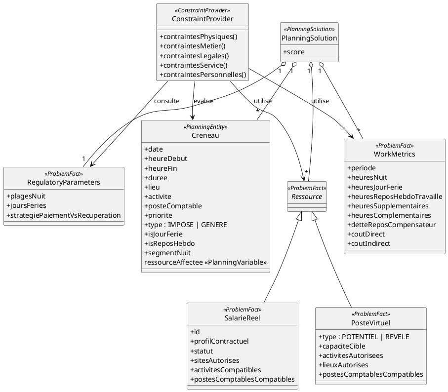

## 📐 Diagramme UML — Modèle métier du moteur de planification (aligné)

```plantuml
@startuml
skinparam style strictuml
skinparam classAttributeIconSize 0

' =========================
' Abstractions
' =========================

abstract class Ressource <<ProblemFact>> {
}

' =========================
' Ressources
' =========================

class SalarieReel <<ProblemFact>> {
  +id
  +profilContractuel
  +statut
  +sitesAutorises
  +activitesCompatibles
  +postesComptablesCompatibles
}

class PosteVirtuel <<ProblemFact>> {
  +type : POTENTIEL | REVELE
  +capaciteCible
  +activitesAutorisees
  +lieuxAutorises
  +postesComptablesCompatibles
}

Ressource <|-- SalarieReel
Ressource <|-- PosteVirtuel

' =========================
' Créneau (besoin)
' =========================

class Creneau <<PlanningEntity>> {
  +date
  +heureDebut
  +heureFin
  +duree
  +lieu
  +activite
  +posteComptable
  +priorite
  +type : IMPOSE | GENERE
  +isJourFerie
  +isReposHebdo
  +segmentNuit
}

' =========================
' Variable de décision
' =========================

Creneau : ressourceAffectee <<PlanningVariable>>

' =========================
' Paramètres réglementaires
' =========================

class RegulatoryParameters <<ProblemFact>> {
  +plagesNuit
  +joursFeries
  +strategiePaiementVsRecuperation
}

' =========================
' Indicateurs dérivés
' =========================

class WorkMetrics <<ProblemFact>> {
  +periode
  +heuresNuit
  +heuresJourFerie
  +heuresReposHebdoTravaille
  +heuresSupplementaires
  +heuresComplementaires
  +detteReposCompensateur
  +coutDirect
  +coutIndirect
}

' =========================
' Contraintes (évaluation)
' =========================

class ConstraintProvider <<ConstraintProvider>> {
  +contraintesPhysiques()
  +contraintesMetier()
  +contraintesLegales()
  +contraintesService()
  +contraintesPersonnelles()
}

' =========================
' Solution globale
' =========================

class PlanningSolution <<PlanningSolution>> {
  +score
}

PlanningSolution "1" o-- "*" Creneau
PlanningSolution "1" o-- "*" Ressource
PlanningSolution "1" o-- "*" WorkMetrics
PlanningSolution "1" o-- "1" RegulatoryParameters

ConstraintProvider --> Creneau : evalue
ConstraintProvider --> Ressource : utilise
ConstraintProvider --> WorkMetrics : utilise
ConstraintProvider --> RegulatoryParameters : consulte

@enduml
```
