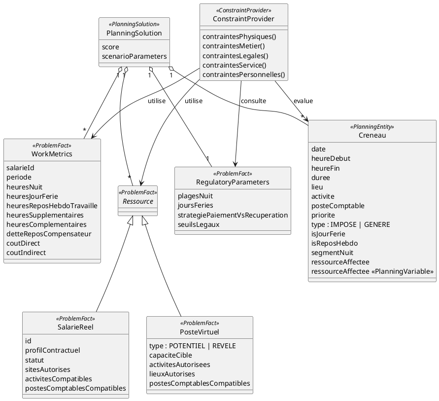

## 📐 Diagramme UML — Modèle métier enrichi OptaPlanner

```plantuml
@startuml
skinparam style strictuml
skinparam classAttributeIconSize 0

' ==================================================
' Solution globale
' ==================================================

class PlanningSolution <<PlanningSolution>> {
  score
  scenarioParameters
}

' ==================================================
' Paramètres réglementaires et stratégiques
' ==================================================

class RegulatoryParameters <<ProblemFact>> {
  plagesNuit
  joursFeries
  strategiePaiementVsRecuperation
  seuilsLegaux
}

' ==================================================
' Ressource (abstraction)
' ==================================================

abstract class Ressource <<ProblemFact>> {
}

class SalarieReel <<ProblemFact>> {
  id
  profilContractuel
  statut
  sitesAutorises
  activitesCompatibles
  postesComptablesCompatibles
}

class PosteVirtuel <<ProblemFact>> {
  type : POTENTIEL | REVELE
  capaciteCible
  activitesAutorisees
  lieuxAutorises
  postesComptablesCompatibles
}

Ressource <|-- SalarieReel
Ressource <|-- PosteVirtuel

' ==================================================
' Indicateurs dérivés / Compteurs de temps de travail
' ==================================================

class WorkMetrics <<ProblemFact>> {
  salarieId
  periode
  heuresNuit
  heuresJourFerie
  heuresReposHebdoTravaille
  heuresSupplementaires
  heuresComplementaires
  detteReposCompensateur
  coutDirect
  coutIndirect
}

' ==================================================
' Créneau (entité de décision)
' ==================================================

class Creneau <<PlanningEntity>> {
  date
  heureDebut
  heureFin
  duree
  lieu
  activite
  posteComptable
  priorite
  type : IMPOSE | GENERE
  isJourFerie
  isReposHebdo
  segmentNuit
  ressourceAffectee
}

' ==================================================
' Variable de décision
' ==================================================

Creneau : ressourceAffectee <<PlanningVariable>>

' ==================================================
' Contraintes
' ==================================================

class ConstraintProvider <<ConstraintProvider>> {
  contraintesPhysiques()
  contraintesMetier()
  contraintesLegales()
  contraintesService()
  contraintesPersonnelles()
}

' ==================================================
' Relations
' ==================================================

PlanningSolution "1" o-- "*" Creneau
PlanningSolution "1" o-- "*" Ressource
PlanningSolution "1" o-- "*" WorkMetrics
PlanningSolution "1" o-- "1" RegulatoryParameters

ConstraintProvider --> Creneau : evalue
ConstraintProvider --> Ressource : utilise
ConstraintProvider --> WorkMetrics : utilise
ConstraintProvider --> RegulatoryParameters : consulte

@enduml
```
